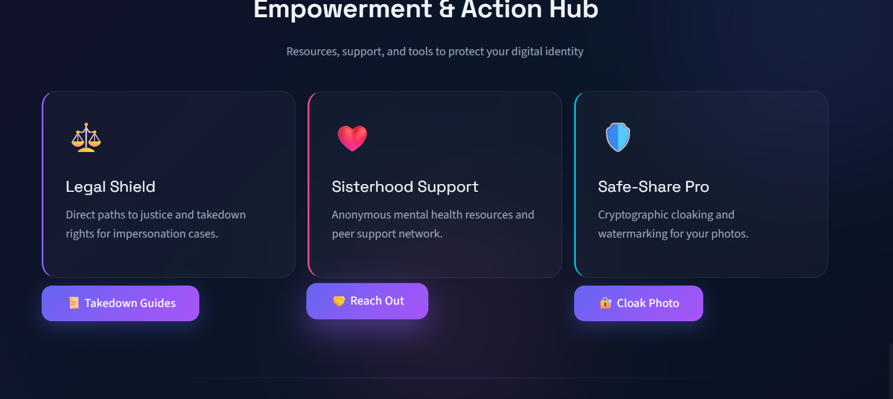
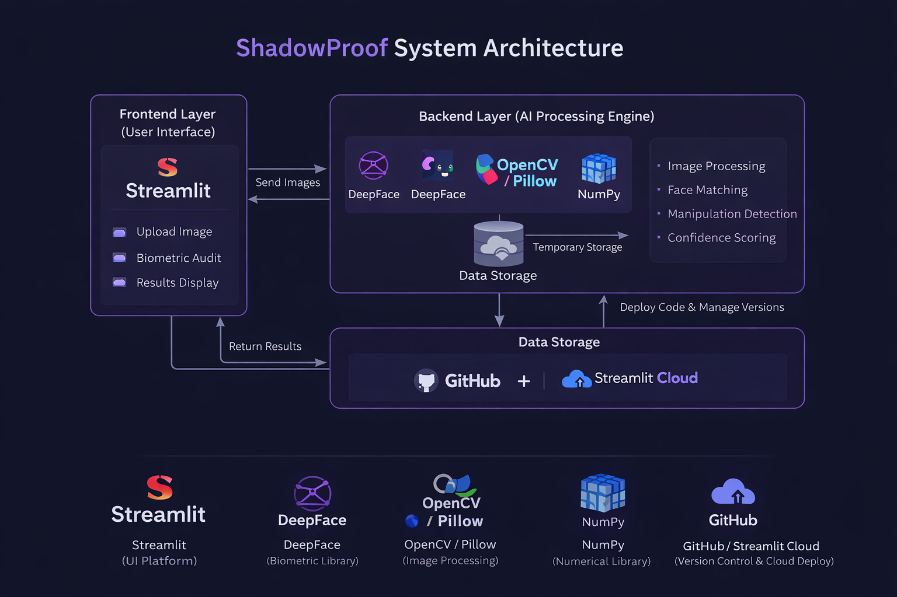
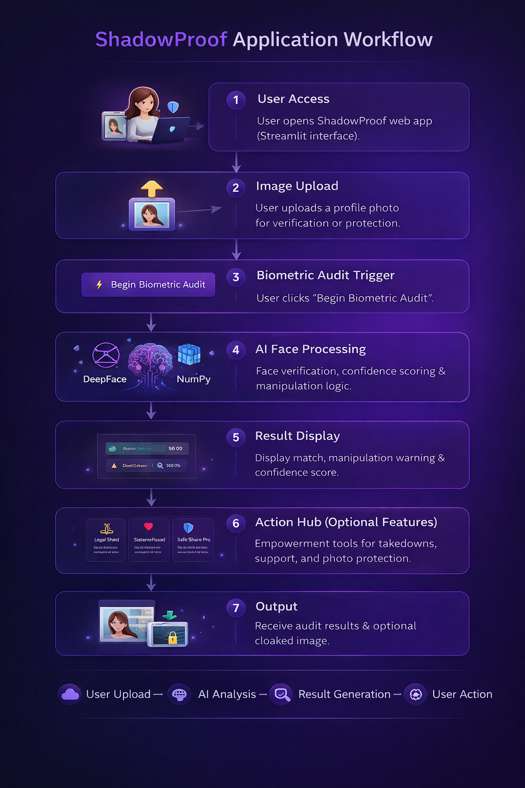
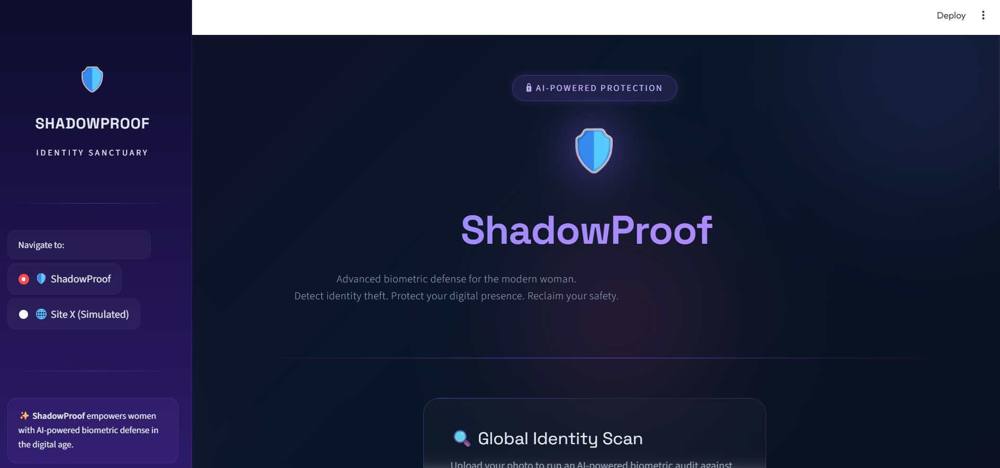
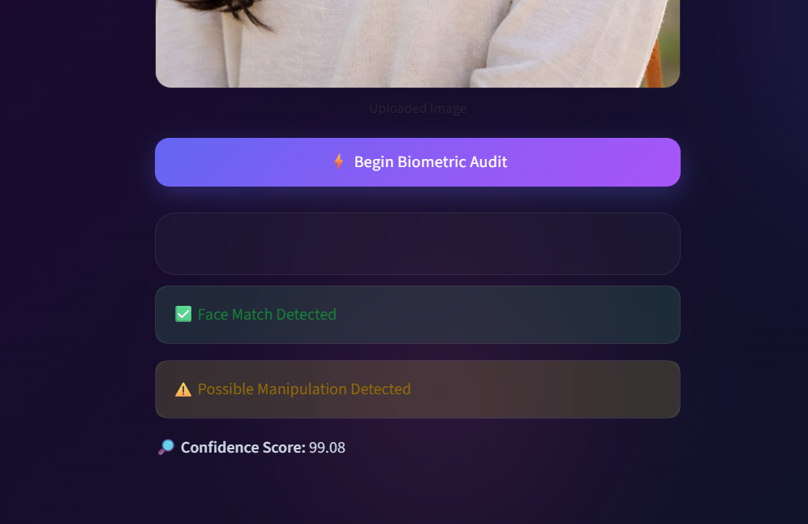

<p align="center">
  
</p>

# ShadowProof 🎯

## Basic Details

### Team Name: SheCoders

### Team Members
- Member 1: Bilja K Saji - Viswajyothi College Of Engineering And Technology
- Member 2: Deena George - Viswajyothi College Of Engineering And Technology


### Hosted Project Link
(https://shadowproof-jnriyegzqfvtzz3ycqiof2.streamlit.app/)

### Project Description
ShadowProof is an AI-powered cybersecurity platform protecting women from deepfake, morphed image abuse and digital blackmailing. It also combines smart detection with instant legal and emotional support.

### The Problem statement
-Rapid increase in online impersonation and fake profiles on social media.

-Women are disproportionately targeted for identity theft and image misuse.

-Misused photos can lead to harassment, blackmail, and emotional distress.

-Existing platforms lack proactive identity verification tools.

-Victims are often unaware of legal remedies and reporting procedures.

-There is a need for an AI-powered solution to detect face misuse, protect images, and provide legal/support guidance.

### The Solution
Develop ShadowProof, an AI-powered identity protection web application.

Use facial recognition (DeepFace) to detect potential impersonation or face misuse.

Provide a confidence score to indicate match reliability.

Offer photo cloaking/watermarking to protect images before sharing online.

Include a Legal Shield section with takedown steps and cybercrime resources.

Provide a Sisterhood Support section with helplines and mental health guidance.

Create a simulated social platform (Site X) to test identity misuse scenarios safely.

Deliver an all-in-one platform for detection, prevention, and support.

---

## Technical Details

### Technologies/Components Used

**Software**
- Languages used: Python, HTML, CSS
- Frameworks used: Streamlit
- Libraries used: DeepFace, TensorFlow / Keras, Pillow (PIL), OS
- Tools used: VS Code, Git & GitHub, Python Virtual Environment (venv), Streamlit CLI, Web Browser (Chrome/Edge for testing)
---

## Features

- Feature 1: AI-Based Face Verification
- Feature 2: Biometric Confidence Scoring
- Feature 3: Safe-Share Pro (Image Cloaking)
- Feature 4: Empowerment & Support Hub
- Feature 5: Site X (Simulated Social Platform)

---

## Implementation

### For Software:

#### Installation
```bash
# 1️⃣ Clone the repository
git clone https://github.com/your-username/shadowproof.git

# 2️⃣ Navigate to the project folder
cd shadowproof

# 3️⃣ Create a virtual environment (recommended)
python -m venv venv

# 4️⃣ Activate the virtual environment
# For Windows:
venv\Scripts\activate

# For macOS/Linux:
source venv/bin/activate

pip install streamlit deepface tensorflow pillow
```

#### Run
```bash
[Run commands - e.g., npm start, python app.py]
```

### For Hardware:

#### Components Required
[List all components needed with specifications]

#### Circuit Setup
[Explain how to set up the circuit]

---

## Project Documentation

### For Software:

#### Screenshots (Add at least 3)


AI-powered identity verification showing successful face match detection with 99.08% confidence and manipulation alert.


A dark-themed “Empowerment & Action Hub” webpage section featuring three glowing cards—Legal Shield, Sisterhood Support, and Safe-Share Pro—offering justice resources, mental health support, and photo protection tools.


ShadowProof homepage showcasing an AI-powered biometric protection platform with a dark, modern interface designed to detect identity theft and safeguard digital presence.

#### Diagrams

**System Architecture:**


ShadowProof follows a simple 3-layer architecture:

Frontend (Streamlit UI):
Users upload images and initiate the biometric audit through an interactive web interface.

Backend (AI Processing Layer):
The uploaded images are processed using DeepFace, OpenCV, NumPy, and Pillow for face matching, manipulation detection, and confidence score calculation.

Deployment & Storage:
The application code is managed via GitHub and deployed on Streamlit Cloud, with temporary image storage during processing.

Data flows from the user → AI processing → results displayed back to the user in real time.

**Application Workflow:**


Application Workflow (ShadowProof)

User Access

User opens the ShadowProof web app (Streamlit interface).

Image Upload

User uploads a profile photo for verification or protection.

Biometric Audit Trigger

User clicks “Begin Biometric Audit.”

AI Face Processing

Image is temporarily stored.

DeepFace performs face verification.

Distance score is calculated.

Confidence score is generated.

Basic manipulation logic is evaluated.

Result Display

System displays:

✅ Face Match Detected / ❌ No Match

⚠️ Manipulation Warning (if applicable)

🔎 Confidence Score

Action Hub (Optional Features)

⚖️ Legal Shield → Shows takedown steps & cybercrime links

❤️ Sisterhood Support → Displays helpline & support resources

🛡️ Safe-Share Pro → Adds digital watermark to protect images

Output

User receives audit results and optional cloaked image for download/view.

Flow Summary:
User Upload → AI Analysis → Result Generation → Empowerment Tools → User Action.

---


#### Build Photos

  
ShadowProof is a Streamlit-based AI web app that detects identity misuse using DeepFace facial verification. Users upload a photo, and the system analyzes face match, manipulation risk, and confidence score.

It also includes Legal Shield, Sisterhood Support, and Safe-Share Pro (image watermarking) features.

The app is deployed on Streamlit Cloud and integrates UI, AI processing, and protection tools in one platform focused on women’s digital safety.

---
